# Data Strutures And Algorithms In CPP

A small C++ header library implements some popular data structures and algorithms.   

I try to implement some of data structures and algorithms that I have been learning becauce of a simple reason. I am learning them today and will forget everything about them tomorrow 😅. 

## Table of Contents
- [About the Library](#about-the-library)
- [Sorting Algorithm Benchmark](#sorting-algorithm-benchmark)
- [To do](#to-do)
- [Acknowledgment](#acknowledgement)

## About the Library
- The library is written in C++, placed in `experimental` namespace and stored in `./inc/`
- There is an unit test for each type of data structures and sorting algorithms, which can be found in `./ut`, to evaluate the correctness of the implementation.

### Data Structures
- [vector](./inc/ds/experimental_vector.hpp): automatically-resized container in which elements are stored contiguously.
- [stack](./inc/ds/experimental_stack.hpp): FIFO data structure that supports `push` elements to and `pop` elements from the end.
- [list](./inc/ds/experimental_list.hpp): container that supports insertion and removal of elements at anywhere in the container.    
In this library, `list` is implemented as a doubly-linked list.
- [binary search tree](./inc/ds/experimental_binary_search_tree.hpp): tree data structure in which a node can only have at max two children. The value of a node is greater than value of any nodes from the left subtree and less than value of any nodes from the right subtree.   
In this library, `binary search tree` does not store duplicates.
- [avl tree](./inc/ds/experimental_avl_tree.hpp): auto-balancing binary search tree.   
In this library, `avl tree` does not store duplicates.
- [binary heap](./inc/ds/experimental_binary_heap.hpp): a node has at max two children and its value is not greater than its children.   
In this library, `binary heap` is defaulted as a **min heap** and supports duplicates.

### Sorting Algorithms
- [insertion sort](./inc/sorts/experimental_insertion_sort.hpp)
- [heap sort](./inc/sorts/experimental_heap_sort.hpp)
- [shell sort](./inc/sorts/experimental_shell_sort.hpp): uses Sedgewick's increment sequence.
- [merge sort](./inc/sorts/experimental_merge_sort.hpp)
- [quick sort](./inc/sorts/experimental_quick_sort.hpp): strategy of picking pivot is to select the median of the three: `arr[left], arr[center], arr[right]`

### Unit Tests
Each unit test is a function that returns `true` if the test is passed, `false` otherwise. And the macro `_RUN_UNIT_TEST_(X)` is designated to run a specific unit test and output the result to console.

## Sorting Algorithm Benchmark
Test and time the running time of sorting algorithms with various inputs.  
The sorting algorithms that are benchmarked are:   
- Heap sort
- Shell sort
- Merge sort
- Quick sort

All the code that is used to generate the benchmark inputs as well as run the test can be found in `./sorting_benchmark`.

### Inputs
There are three main inputs that are used to benchmark, which are only integer numbers.    
- **Small keys**: Inputs that contain only a few unique keys. The unique keys account for one percentage (**1%**) of the input's size.    
- **Unique keys**: Inputs that contain unique keys (no duplicate).
- **Normal distributed keys**: Inputs that are generated from C++ standard normal distribution generator.    

For the first two types of inputs, there are four properties that are combined with: 
- **Sorted**: The list is sorted in ascending order.
- **Reversed sorted**: The list is sorted in descending order.
- **Almost sorted**: The list is sorted then suffled. The percentage of numbers that are suffled is five percentage (**5%**) of the input's size.
- **Random**: The list is in random order.   

For the normal distributed inputs, there are two properties that are combined with:   
- **Small deviation**: The standard deviation is set to _**size/100.0**_ where **size** is the input's size.
- **Large deviation**: The standard deviation is set to _**size/10.0**_.   

>**Note:** The generated input size can be quite large. The total size is about **41GB**.   

    
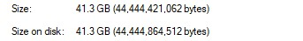

### Setup
There are five different generated lists for each type of inputs. Each list is run once and the average of five results is calculated.   

To measure the running time, `std::chrono::high_resolution_clock` from C++ standard library is called before and after a sorting function's call.

All the tests were run in a laptop with CPU of **1.8 Ghz** (no boosting technology).

### Results
Execution times are given in **microseconds**.

#### Heap sort
- Small keys   

    | Size | 1,000 | 10,000 | 100,000 | 1,000,0000 | 10,000,000 | 100,000,000 |
    | --- | ---: | ---: | ---: | ---: |---: | ---: |
    | Sorted | 91.2 | 772.2 | 8,139.6 | 8,9865.4 | 993,129.2 | 10,696,308.2 |
    | Reversed sorted | 67.4 | 856.4 | 9,009.6 | 102,102.4 | 1,154,648.8 | 12,841,871.2 |
    | Almost sorted | 68.6 | 809.0 | 8,700.4 | 102,705.6 | 1,258,856.4 | 15,720,086.0 |
    | Random | 82.8 | 1,117.0 | 14,456.4 | 199,536.8 | 3,695,541.6 | 61,666,823.8 |

    

    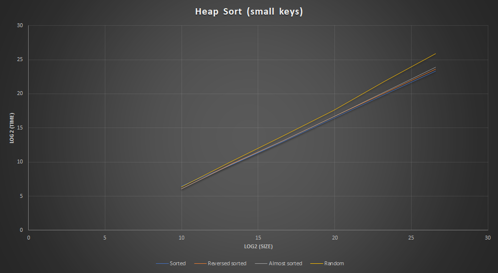

    

- Unique keys

    | Size | 1,000 | 10,000 | 100,000 | 1,000,0000 | 10,000,000 | 100,000,000 |
    | --- | ---: | ---: | ---: | ---: |---: | ---: |
    | Sorted | 74.25 | 760.6 | 8,235.8 | 92,963.8 | 1,049,428.2 | 11,471,786.6 |
    | Reversed sorted | 73.2 | 826.6 | 8,947.4 | 101,332.2 | 1,143,663.8 | 12,815,198.4 |
    | Almost sorted | 77.4 | 830.2 | 8,961.4 | 103,342.4 | 1,271,909.2 | 15,250,362.4 |
    | Random | 86.6 | 1,181.6 | 14,559.6 | 202,811.8 | 3,905,962.2 | 62,339,715.8 |

    

    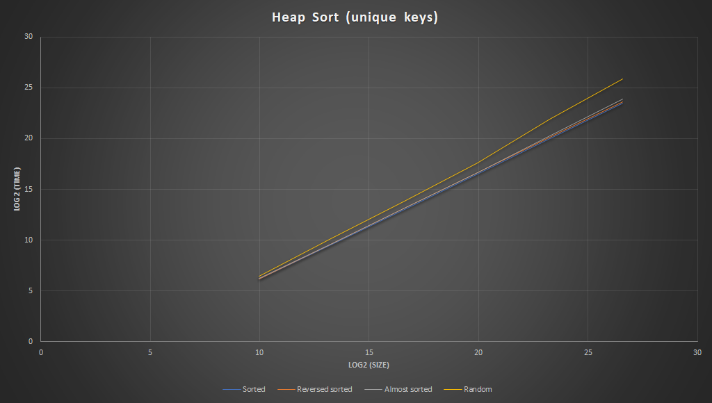

    

- Normal distributed keys

    | Size | 1,000 | 10,000 | 100,000 | 1,000,0000 | 10,000,000 | 100,000,000 |
    | --- | ---: | ---: | ---: | ---: |---: | ---: |
    | Small | 87.0 | 1,134.6 | 1,5533.2 | 209,343.2 | 4,159,698.4 | 65,978,598.2 |
    | Large | 91.0 | 1,140.6 | 1,4929.4 | 210,047.6 | 4,136,412.8 | 66,994,912.2 |

    

    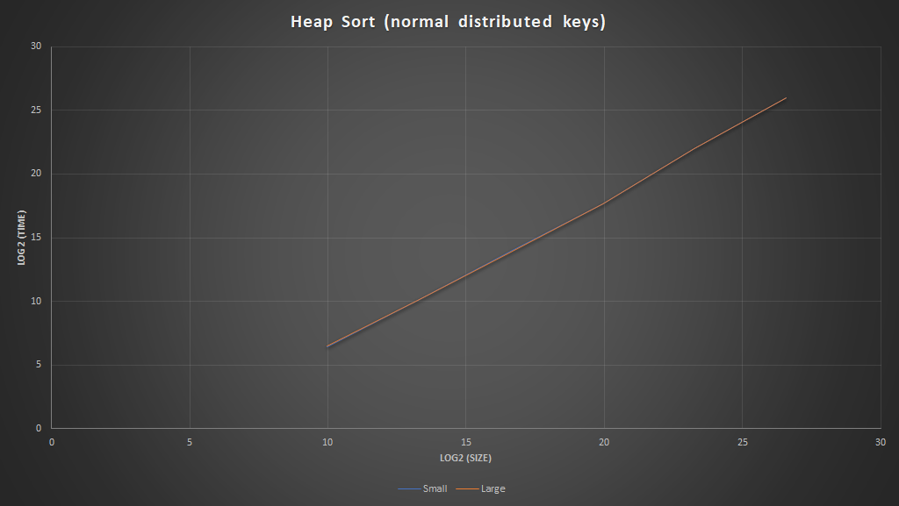

    

#### Shell sort
- Small keys

    | Size | 1,000 | 10,000 | 100,000 | 1,000,0000 | 10,000,000 | 100,000,000 |
    | --- | ---: | ---: | ---: | ---: |---: | ---: |
    | Sorted | 16.4 | 221.2 | 2,767.0 | 35,251.2 | 437,274.4 | 5,124,754 |
    | Reversed sorted | 17.6 | 245.8 | 3,203.4 | 40,462.2 | 494,578.2 | 5,759,613.8 |
    | Almost sorted | 23.2 | 589.0 | 10,406.4 | 156,818.6 | 2,125,695 | 27,050,273.8 | 
    | Random | 54.6 | 1,035.8 | 15,100.4 | 209,219.2 | 2,676,515.6 | 32,428,322 |

    

    

    

- Unique keys

    | Size | 1,000 | 10,000 | 100,000 | 1,000,0000 | 10,000,000 | 100,000,000 |
    | --- | ---: | ---: | ---: | ---: |---: | ---: |
    | Sorted | 12.6 | 205.0 | 2,742.0 | 35,229.2 | 436114.0 | 5,128,459.4 |
    | Reversed sorted | 24.2 | 307.6 | 3,802.4 | 46,241.2 | 552,650.0 | 6,371,115.8 |
    | Almost sorted | 55.8 | 971.6 | 14,140.0 | 193,463.8 | 2,489,795.0 | 30,781,830.2 |
    | Random | 91.0 | 1,358.8 | 18,517.8 | 237,973.8 | 2,971,110.2 | 35,953,170.0 |

    

    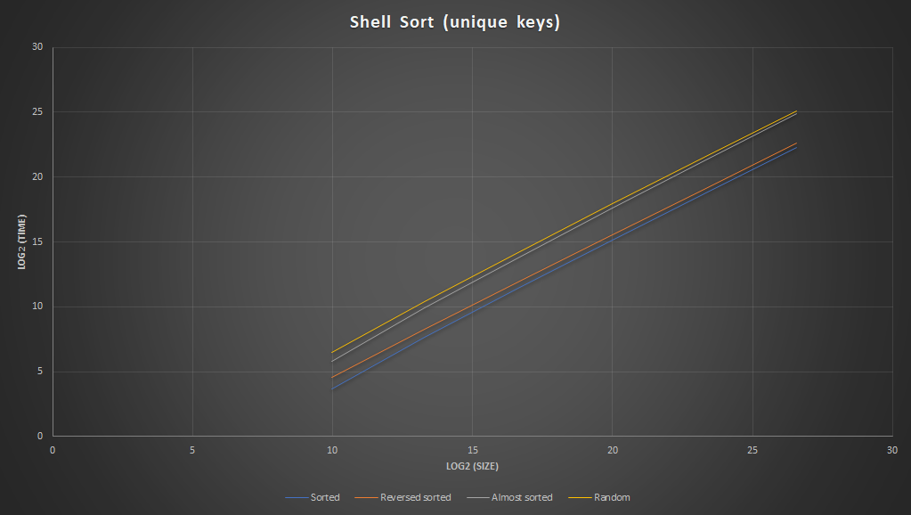

    

- Normal distributed keys

    | Size | 1,000 | 10,000 | 100,000 | 1,000,0000 | 10,000,000 | 100,000,000 |
    | --- | ---: | ---: | ---: | ---: |---: | ---: |
    | Small | 74.0 | 1,232.2 | 16,870.0 | 220,730.0 | 2,806,819.2 | 34,294,863.6 |
    | Large | 94.0 | 1,359.0 | 18,585.0 | 236,668.2 | 2,966,239.6 | 35,943,240.6 |

    

    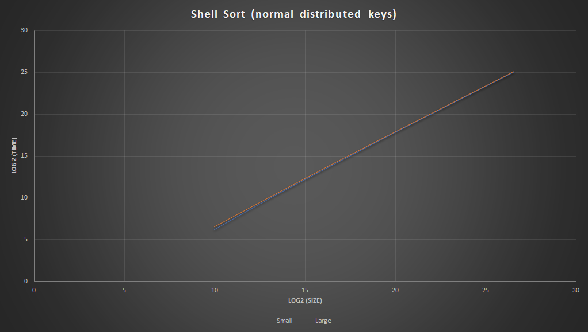

    

#### Merge sort
- Small keys

    | Size | 1,000 | 10,000 | 100,000 | 1,000,0000 | 10,000,000 | 100,000,000 |
    | --- | ---: | ---: | ---: | ---: |---: | ---: |
    | Sorted | 90.0 | 748.8 | 8,817.0 | 107,084.2 | 1,212,825.6 | 13,838,085.6 |
    | Reversed sorted | 72.8 | 694.8 | 8,397.2 | 99,579.0 | 1,159,598.4 | 13,237,406.8 |
    | Almost sorted | 82.8 | 977.0 | 11,528.2 | 142,568.2 | 1,657,765.0 | 19,143,615.2 |
    | Random | 89.8 | 1,148.2 | 13,000.2 | 156,994.2 | 1,827,231.6 | 20,573,645.2 |

    

    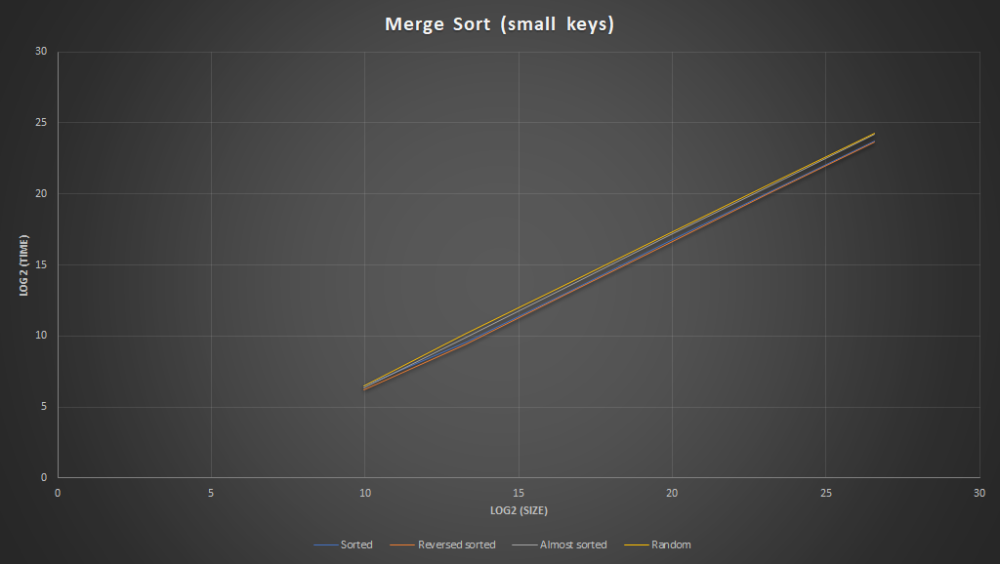

    

- Unique keys

    | Size | 1,000 | 10,000 | 100,000 | 1,000,0000 | 10,000,000 | 100,000,000 |
    | --- | ---: | ---: | ---: | ---: |---: | ---: |
    | Sorted | 56.2 | 769.4 | 8,346.0 | 98,399.2 | 1,153,871.6 | 13,077,888.4 |
    | Reversed sorted | 56.6 | 688.6 | 8,204.2 | 99,887.4 | 1,174,102.8 | 13,273,144.8 |
    | Almost sorted | 69.8 | 912.2 | 11,315.2 | 140,638.6 | 1,659,888.6 | 18,902,373.2 |
    | Random | 85.6 | 1,177.2 | 13,031.6 | 156,557.0 | 1,821,084.4 | 20,550,195.2 |

    

    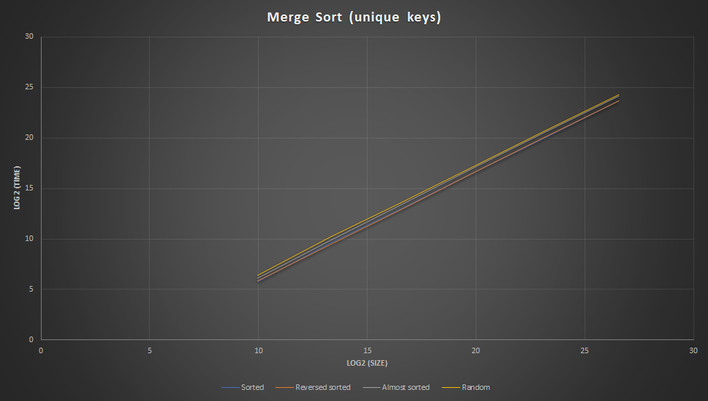

    

- Normal distributed keys

    | Size | 1,000 | 10,000 | 100,000 | 1,000,0000 | 10,000,000 | 100,000,000 |
    | --- | ---: | ---: | ---: | ---: |---: | ---: |
    | Small | 89.6 | 2,014.0 | 13,552.6 | 156,659.4 | 1,816,660.6 | 20,817,199.2 |
    | Large | 92.2 | 1,513.8 | 13,008.4 | 156,460.0 | 1,819,938.8 | 20,637,363.4 |

    

    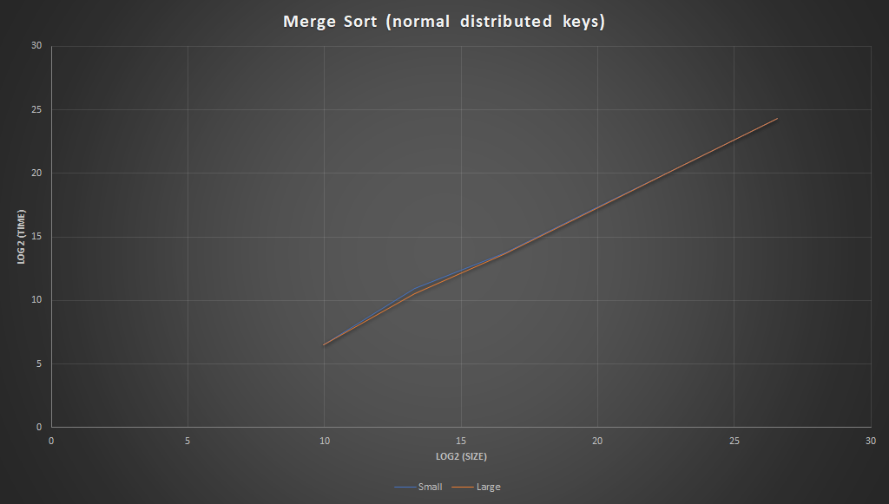

    

#### Quick sort
- Small keys

    | Size | 1,000 | 10,000 | 100,000 | 1,000,0000 | 10,000,000 | 100,000,000 |
    | --- | ---: | ---: | ---: | ---: |---: | ---: |
    | Sorted | 22.2 | 206.4 | 1,989.8 | 22,260.6 | 245,654.2 | 2,680,949.0 |
    | Reversed sorted | 21.0 | 209.4 | 2,099.8 | 23,297.4 | 259,176.0 | 2,820,935.2 |
    | Almost sorted | 22.0 | 274.8 | 2,796.0 | 33,053.0 | 366,446.0 | 4,074,728.8 |
    | Random | 37.8 | 566.2 | 7,507.4 | 93,871.6 | 1,139,483.2 | 13,065,503.6 |

    

    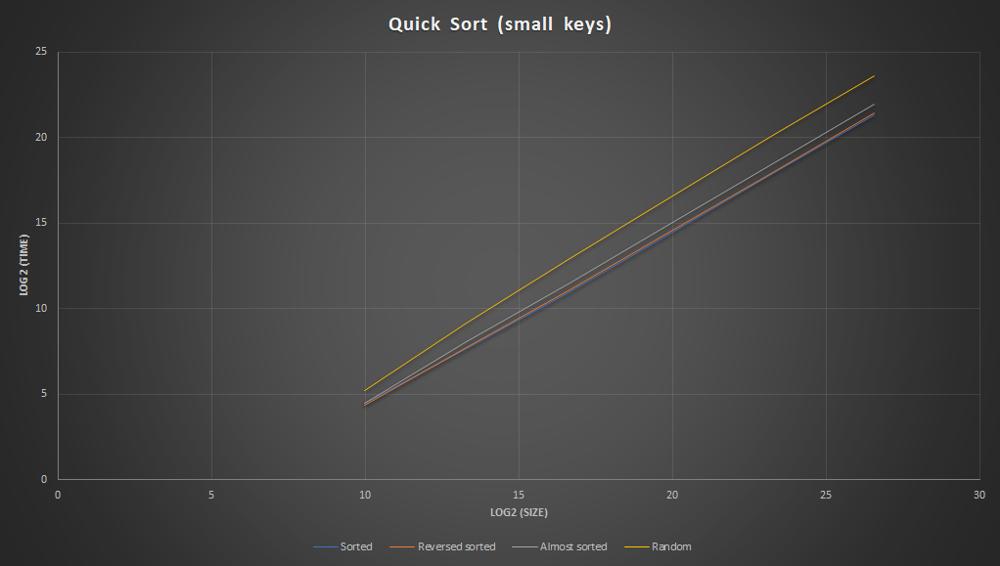

    

- Unique keys

    | Size | 1,000 | 10,000 | 100,000 | 1,000,0000 | 10,000,000 | 100,000,000 |
    | --- | ---: | ---: | ---: | ---: |---: | ---: |
    | Sorted | 10.0 | 120.8 | 1,314.6 | 15,915.4 | 180,824.4 | 2,018,509.8 |
    | Reversed sorted | 18.4 | 188.2 | 2,217.2 | 26,721.8 | 313,151.6 | 3,605,260.6 |
    | Almost sorted | 15.8 | 188.2 | 2,244.8 | 26,701.0 | 308,801.0 | 3,529,591.4 |
    | Random | 61.0 | 776.4 | 9,630.0 | 115,072.8 | 1,332,870.4 | 15,201,778.4 |

    

    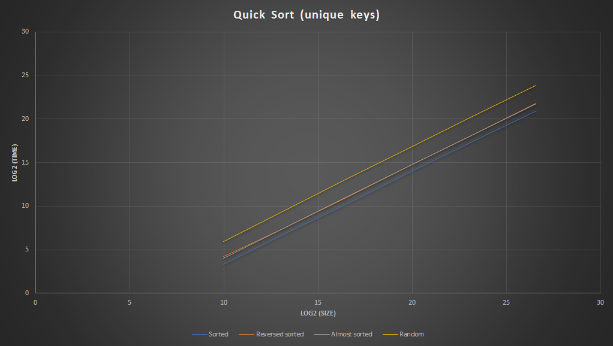

    

- Normal distributed keys

    | Size | 1,000 | 10,000 | 100,000 | 1,000,0000 | 10,000,000 | 100,000,000 |
    | --- | ---: | ---: | ---: | ---: |---: | ---: |
    | Small | 47.0 | 661.2 | 8,431.6 | 103,441.8 | 1,224,965.8 | 14,198,722.6 |
    | Large | 62.2 | 772.0 | 9,696.4 | 115,157.6 | 1,348,569.2 | 15,398,086.0 |

    

    

    

#### Comparision
- Random small keys

    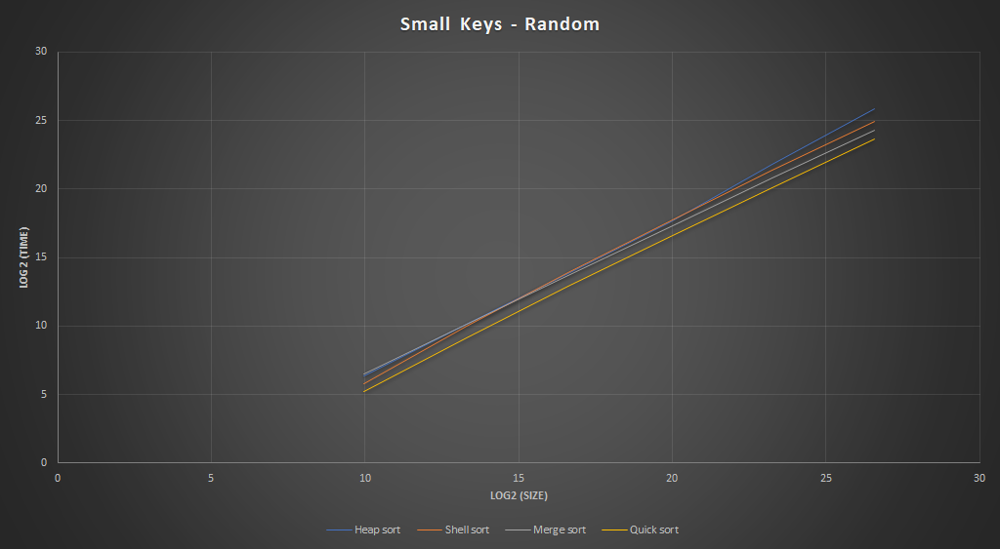

- Random unique keys

    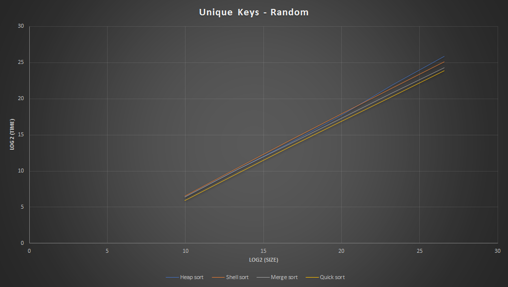

## To do
- Implement some special sorting algorithms like radix sort.
- Try to implement multi-threading shell sort since it seems to be able to do so.

## Acknowledgement
- Thanks to **Data Structures And Algorithm Analysis in C++ (4th ed) - Mark Allen Weiss** book for detailed explanation about those data structures and algorithms.
- Special thanks to my laptop for keeping its sanity in about an hour to generate sorting benchmark inputs and about three hours straight to run those tests.
